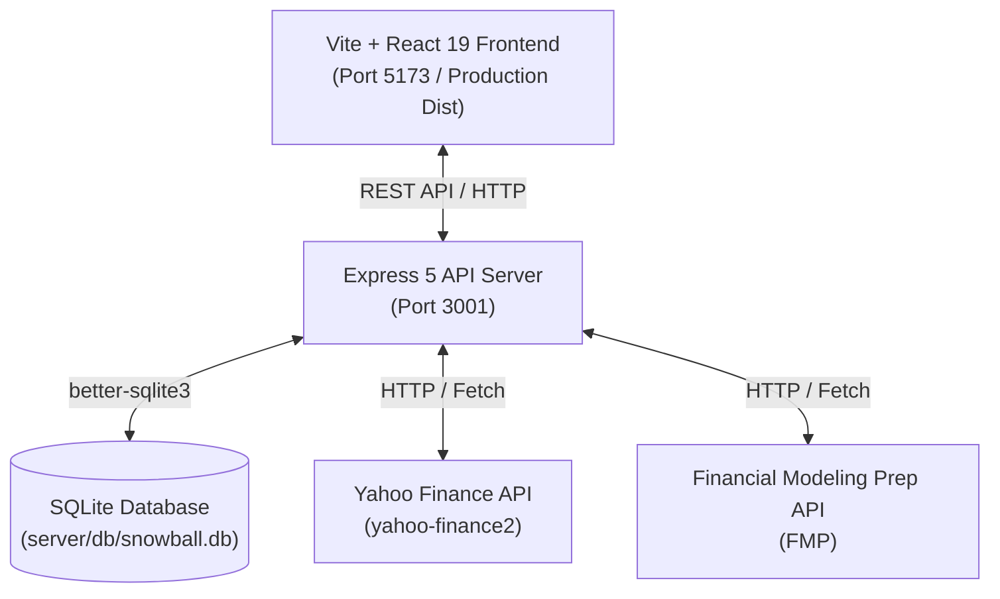

# 🏗️ Snowball-IF System Architecture & Engineering Reference

This document serves as the technical blueprint and reference guide for software engineers and **AI coding agents** working on the **Snowball-IF** codebase.

---

## 1. System Overview

Snowball-IF follows a decoupled **Client-Server Architecture** with a persistent local **SQLite database**:



- **Frontend**: Single Page Application (SPA) built with React 19, Vite, React Router v7, Recharts, and Vanilla CSS design tokens.
- **Backend**: Node.js micro-service using Express 5. Handles data aggregation, currency conversions, dividend detection algorithms, and API caching.
- **Database**: Embedded SQLite engine managed via `better-sqlite3` synchronously for fast local file-based database operations.

---

## 2. Database Schema (`server/db/schema.sql`)

The application stores user transactions, cached market quotes, historical stock prices, currency exchange rates, and app configuration in SQLite:

```
+-------------------+      +--------------------+      +-----------------------+
|   transactions    |      |    stocks_cache    |      |    exchange_rates     |
+-------------------+      +--------------------+      +-----------------------+
| id (PK)           |      | ticker (PK)        |      | date (PK)             |
| event_type        |      | fmp_ticker         |      | from_currency (PK)    |
| date              |      | name               |      | to_currency (PK)      |
| ticker            |      | sector             |      | rate                  |
| fmp_ticker        |      | industry           |      +-----------------------+
| price             |      | current_price      |
| quantity          |      | currency           |      +-----------------------+
| currency          |      | dividend_yield     |      |     price_history     |
| fee_tax           |      | dividend_growth_5y |      +-----------------------+
| exchange          |      | week52_high        |      | ticker (PK)           |
| fee_currency      |      | sma_10, sma_50     |      | date (PK)             |
| notes             |      | sma_100, sma_200   |      | close_price           |
| sector            |      | last_updated       |      +-----------------------+
+-------------------+      +--------------------+
```

### Table Details:
1. **`transactions`**: The source of truth for portfolio position calculations. Supported `event_type` values: `BUY`, `SELL`, `DIVIDEND`, `STOCK_AS_DIVIDEND`.
2. **`stocks_cache`**: Caches company metadata, sector/industry, current market price, dividend metrics, 52-week highs, and Simple Moving Averages (SMA 10, 50, 100, 200) to minimize external API usage.
3. **`exchange_rates`**: Daily FX rates against `HOME_CURRENCY` (EUR, USD, GBP).
4. **`price_history`**: End-of-day price records for historical portfolio evaluation and performance charting.
5. **`settings`**: Key-value pairs for configuration parameters (e.g., `home_currency`, `api_keys`).

---

## 3. Backend Architecture (`server/`)

### Directory Breakdown
```
server/
├── index.js               # Server initialization, CORS, middleware, static file routing
├── db/
│   ├── database.js        # SQLite database connection & migrations
│   ├── schema.sql         # Base SQL DDL definitions
│   └── snowball.db        # SQLite database file
├── routes/
│   ├── transactions.js    # /api/transactions CRUD endpoints
│   ├── portfolio.js       # /api/portfolio metrics & holdings endpoints
│   ├── dividends.js       # /api/dividends history, matrix, and detection endpoints
│   ├── market.js          # /api/market stock search & cache updates
│   └── settings.js       # /api/settings app configuration endpoints
└── services/
    ├── calculations.js    # Holding ledger snapshots, cost basis & IRR calculation
    ├── currencyService.js # Exchange rate fetching & conversion cache
    ├── marketData.js      # Yahoo Finance / FMP API wrapper & price caching
    ├── dividendDetector.js# Missing dividend detection algorithm
    ├── csvImporter.js     # Broker CSV parser & column mapping logic
    └── tickerMapping.js   # Regional exchange ticker mapping (.L, .MC, .DE)
```

### Key Business Logic & Algorithms

#### 1. Holding Snapshot & Cost Basis Calculation ([calculations.js](file:///Users/rafaolid/Desktop/Snowball-HQ/server/services/calculations.js))
- The backend reconstructs active holdings dynamically by iterating over all historical `transactions`.
- **BUY**: Increments share balance, adds transaction cost to native total cost and calculates EUR cost basis using effective exchange rates.
- **SELL**: Reduces share balance and proportionally reduces total cost basis.
- **STOCK_AS_DIVIDEND**: Increments share count with zero principal addition (only fees/taxes added to cost basis).
- **DIVIDEND**: Accumulates received dividends converted to home currency.

#### 2. LSE GBX (Pence) vs GBP (Pounds) Handling Rules
- London Stock Exchange tickers (`.L`) often quote prices in **GBX** (pence, 1/100th of GBP).
- `calculations.js` and `currencyService.js` check whether transaction prices or quotes are in GBX or GBP and apply a `/ 100` divisor when converting to EUR/USD home currencies.

#### 3. Missing Dividend Detection ([dividendDetector.js](file:///Users/rafaolid/Desktop/Snowball-HQ/server/services/dividendDetector.js))
- Analyzes held stock positions against ex-dividend dates provided by market data services.
- If a user held shares on the ex-dividend date of a payout but has no corresponding `DIVIDEND` transaction recorded, the detector flags it as a "Missing Dividend" with estimated expected earnings.

#### 4. Money-Weighted Rate of Return / IRR ([calculations.js](file:///Users/rafaolid/Desktop/Snowball-HQ/server/services/calculations.js))
- Computes Internal Rate of Return (IRR) using the Newton-Raphson numerical approximation method over cash flow events (buys as negative cash flow, dividends and current portfolio value as positive cash flow).

---

## 4. Frontend Architecture (`src/`)

### Directory Breakdown
```
src/
├── App.jsx                # Layout frame, modal states, router setup
├── main.jsx               # React DOM root render
├── index.css              # Global CSS styling system & variables
├── components/
│   ├── Sidebar.jsx        # App navigation sidebar & modal triggers
│   ├── MetricCard.jsx     # Overview summary statistic card
│   ├── DataTable.jsx      # Sortable, paginated data grid component
│   ├── ErrorBoundary.jsx  # React error boundary component
│   ├── TransactionModal.jsx  # Add/Edit single transaction modal
│   ├── ImportModal.jsx    # CSV file upload & preview modal
│   ├── ExportModal.jsx    # CSV data export modal
│   ├── SettingsModal.jsx  # App configuration modal
│   ├── CompanyDividendsModal.jsx # Per-company dividend breakdown modal
│   └── MissingDividendsModal.jsx # Unrecorded dividends review modal
├── pages/
│   ├── Dashboard.jsx      # Portfolio overview & key metrics
│   ├── Holdings.jsx       # Active positions table & cost breakdown
│   ├── Sectors.jsx        # Sector distribution pie charts & allocations
│   ├── Dividends.jsx      # Annual/monthly dividend matrix & schedule
│   ├── FindTheDip.jsx     # Dip screening (52-week low & SMA dips)
│   └── Performance.jsx   # Historical returns & growth charts
└── utils/
    ├── formatters.js      # Currency & percentage formatting helpers
    └── api.js             # API fetch wrappers
```

### Reactive Data Signal Pattern
- State for modals (`showTransactionModal`, `showImportModal`, etc.) is managed in `App.jsx`.
- When transactions or settings change, `handleDataChange()` increments a global `refreshKey` counter state.
- Passing `key={refreshKey}` to page route components forces React to remount the active view and re-fetch updated API datasets cleanly without complex global state stores like Redux.

---

## 5. Guidelines for AI Coding Agents & Developers

When editing or extending this codebase, adhere strictly to the following rules:

### 🛡️ Database & Query Integrity
1. **Always Use Parameterized Queries**: Use `db.prepare('SELECT ... WHERE id = ?').get(id)` via `better-sqlite3`. Never concatenate raw user input strings into SQL statements.
2. **Synchronous Execution**: `better-sqlite3` runs synchronously in Node.js. Do not wrap `db.prepare()` execution in unnecessary `await` calls.

### 💱 Multi-Currency & Unit Rules
1. **Never Assume Currency**: Stock prices can be in USD, EUR, GBP, GBX, CHF, CAD, etc. Always check `t.currency` or `quote.currency`.
2. **Pence (GBX) Division**: Always verify if a price is in pence (`GBX` / `GBp`) before computing valuation. 100 GBX = 1 GBP.

### 🎨 UI & Design Consistency
1. **Vanilla CSS Standard**: Do not install utility CSS frameworks (like TailwindCSS) unless requested. All styles belong in `src/index.css` or scoped component CSS.
2. **Color Palette & Theme**: Maintain dark mode aesthetics with existing color variables (`--bg-primary`, `--bg-secondary`, `--accent-color`, `--text-primary`).

### 🧪 Verification Checklist After Code Edits
After modifying backend routes or frontend components:
- Verify client compilation with `npm run build` or Vite dev server.
- Verify API server status without runtime syntax errors (`node server/index.js`).
- Test currency conversions with multi-currency sample transactions.
